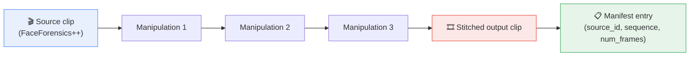
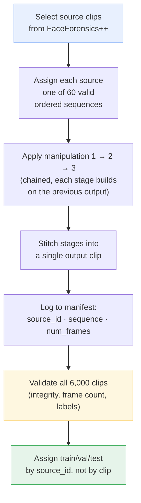

<div align="center">

# 🎭 SeqForensics

### A dataset for detecting the *order* of chained deepfake manipulations

[](LICENSE)
[](requirements.txt)
[](docs/dataset_structure.md)
[](docs/dataset_structure.md)
[](https://github.com/ondyari/FaceForensics)

</div>

---

Most deepfake datasets ask *"what manipulation is this?"* — one clip, one label. In the wild,
forensically interesting videos rarely stop at one edit. They pass through a **chain**: a face
swap, then a re-enactment pass, then a cleanup pass, before they're ever re-uploaded.

**SeqForensics** is built around the harder question: given a clip, can a model recover **which**
manipulations were applied, **in what order**?

<div align="center">



</div>

---

## 📑 Table of contents

- [At a glance](#-at-a-glance)
- [Manipulation vocabulary](#-manipulation-vocabulary)
- [How the dataset is built](#%EF%B8%8F-how-the-dataset-is-built)
- [Repository structure](#-repository-structure)
- [Metadata schema](#-metadata-schema)
- [Validation](#-validation)
- [Quick start](#-quick-start)
- [Baseline task](#-baseline-task)
- [Data availability & licensing](#-data-availability--licensing)
- [Citation](#-citation)

---

## 🔍 At a glance

<div align="center">

| | |
|:---:|:---:|
| **Base data source** | [FaceForensics++](https://github.com/ondyari/FaceForensics) |
| **Generated clips** | `6,000` |
| **Manipulation types** | `5` |
| **Manipulations per clip** | `3`, chained in sequence |
| **Distinct sequence classes** | `60` (ordered permutations, P(5,3)) |
| **Frames per source clip** | `~300–400` |
| **Split strategy** | Source-leakage-free (train / val / test) |

</div>

---

## 🧩 Manipulation vocabulary

Each clip chains **3 of 5** manipulation types drawn from the standard FaceForensics++ set:

| Code | Manipulation | ID |
|:---:|---|:---:|
| 🟦 `DF`  | Deepfakes | `0` |
| 🟩 `F2F` | Face2Face | `1` |
| 🟨 `FS`  | FaceSwap | `2` |
| 🟧 `FSh` | FaceShifter | `3` |
| 🟥 `NT`  | NeuralTextures | `4` |

Labels are stored as ordered, pipe-separated strings — e.g. `FS|FSh|DF` — mapped through **one**
vocabulary table shared by every script in this repo, so generation and validation can never
silently disagree on label order.

Because order matters, the label space is **permutations, not combinations**:

<div align="center">

```
P(5, 3)  =  5 × 4 × 3  =  60 distinct sequence classes
```

</div>

That's what makes the task hard — a model has to reason about *compositional, temporal structure*,
not just spot a single artifact.

---

## ⚙️ How the dataset is built



**Why split by `source_id`?** All sequence variants generated from the *same* source video are
forced into the *same* split. Otherwise a model can cheat by memorizing the source video's identity
instead of learning the manipulation sequence itself.

---

## 📁 Repository structure

```text
SeqForensics/
├── README.md
├── LICENSE
├── requirements.txt
├── code/
│   ├── generate_dataset.py     # builds the 6,000 sequential clips from FF++ sources
│   └── validate_dataset.py     # integrity + label validation over the full dataset
├── metadata/
│   └── sample_metadata.csv     # example rows (schema only — not the full manifest)
├── validation/
│   └── dataset_validation_summary.txt
└── docs/
    └── dataset_structure.md    # metadata schema, naming conventions, folder layout
```

> `code/*.py` and `metadata/sample_metadata.csv` ship alongside this scaffold — this drop covers
> documentation, licensing, and the validation-summary report.

---

## 🗂️ Metadata schema

| Field | Description |
|---|---|
| `video_name` | Filename of the generated sequential clip |
| `source_video` | ID/filename of the original FaceForensics++ source video |
| `sequence` | Pipe-separated manipulation order, e.g. `FS\|FSh\|DF` |
| `num_frames` | Frame count of the generated clip |

Full field-by-field docs, naming convention, and the splitting algorithm live in
[`docs/dataset_structure.md`](docs/dataset_structure.md).

---

## ✅ Validation

All 6,000 generated clips are checked for file integrity, decodability, expected frame count, and
correct sequence-label formatting before entering the final manifest.

📄 Full report: [`validation/dataset_validation_summary.txt`](validation/dataset_validation_summary.txt)

---

## 🚀 Quick start

```bash
# 1. Install dependencies
pip install -r requirements.txt

# 2. Generate the sequential dataset from your local FaceForensics++ copy
python code/generate_dataset.py \
    --ff-root /path/to/FaceForensics++ \
    --out-dir dataset/generated_videos \
    --metadata-out metadata/manifest.csv

# 3. Validate the generated dataset
python code/validate_dataset.py \
    --metadata metadata/manifest.csv \
    --video-root dataset/generated_videos \
    --report-out validation/dataset_validation_report.csv
```


---

## 🔐 Data availability & licensing

- **This repository's code** (generation + validation scripts, docs) is released under
  [`LICENSE`](LICENSE) (MIT).
- **Raw FaceForensics++ source video is not redistributed here.** Access requires agreeing to FF++'s
  own terms — see the [official repository](https://github.com/ondyari/FaceForensics) before
  generating or sharing derived clips.
- Generated sequential clips are derivative of FaceForensics++ source material — check FF++'s
  redistribution terms before publishing the full generated dataset.

---

## 📚 Citation

If you use this dataset construction pipeline, please cite this repository and the original
FaceForensics++ paper (Rössler et al., ICCV 2019).

<div align="center">

*Built for reproducible deepfake-sequence forensics research.*

</div>
